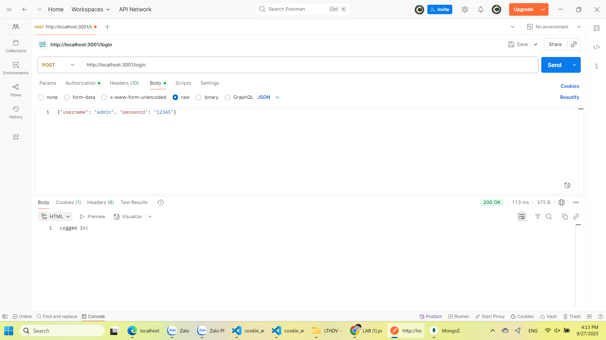
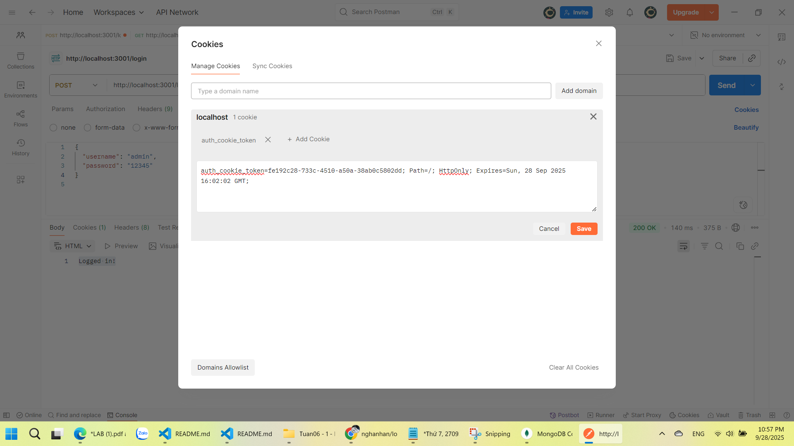
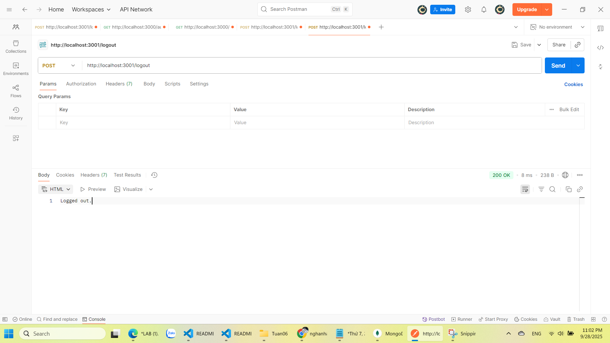

# simple_auth

## Cách chạy
1. Install deps:
```bash
npm install
```

2. Khởi động MongoDB (local or docker).

3. Start servers:
```bash
node basic_auth.js    # port 3000
node cookie_auth.js   # port 3001
```


## Endpoints & How to test (POSTMAN)

### Basic Auth
#### 1. non-secure ("/")
GET `http://localhost:3000/`
Expected: `Welcome! Visit first public resource.`

#### 2. secure 
GET `http://localhost:3000/secure`
Authorization: Basic `admin:12345` → header:  
```
Authorization: Basic YWRtaW46MTIzNDU=
```
Expected: `You have accessed a protected resource 🎉`  


#### 3. public 
GET `http://localhost:3000/public`

Expected: `Welcome! Visit second public resource.`


---

### Cookie Auth
#### 4. login
POST `http://localhost:3001/login`
Body JSON:
```json
{ "username": "admin", "password": "12345" }
```
Expected: `Logged in!`  


#### 5. profile
GET `http://localhost:3001/profile` (cookie must be present)  
Expected: `Welcome user 1, your cookie is valid.`  


#### 6. logout
POST `http://localhost:3001/logout` → cookie deleted.  
Expected: `Logged out.`


#### 7. database mongo
Cookie in DB:  


